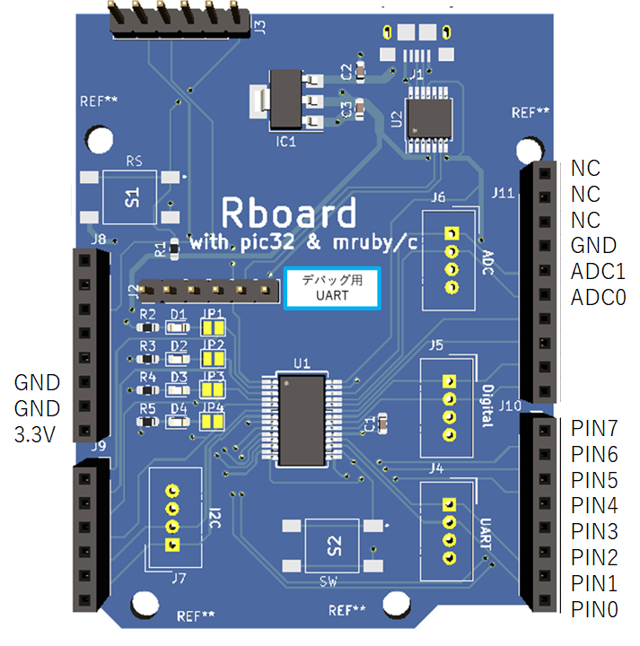

# 2020_11_osaka

## 講座内容

|時間|内容|
|---|---|
10:00 |IoT概要、センサについて
11:00 |ソフト開発環境のセットアップ
|     | [演習1：入出力演習](#enshuu_1)
12:00	|（昼休み）
13:00	| 状態を扱う処理
|     | [演習2：入出力の応用](#enshuu_2)
14:00	| マイコンのIO
|     | [演習3：ソフト・ハード連携](#enshuu_3)
14:30	| センサについて説明
|     | [演習4：センサからの入力](#enshuu_4)
15:30	| [演習5：センサを利用した制御](#enshuu_5)
16:30	| まとめ


## 設定ファイル

- [Rboardのピン設定ファイル](./config.rb)



<a name="enshuu_1"></a>
# 演習1

- led_sample
- sw_sample

サンプルプログラムを動かして、開発環境のセットアップが正しく行われていることを確認する。併せて、プログラム作成～実行までの手順を習得する。


<a name="enshuu_2"></a>
# 演習2

- sw2_sample
- state_sample

状態を持ったプログラムについて理解をする。状態を持つことで、複雑な処理が可能となる。組み込みソフトでは、状態遷移図や状態遷移表を使って管理することが多い。

sw2_sample は状態を扱っているが、うまく動作しない。


<a name="enshuu_3"></a>
# 演習3

- led_pin

ブレッドボード上に配置したLEDを点滅させる。動作自体は led_sample と同じ。

<a name="enshuu_4"></a>
# 演習4

- temp_sample

ADCを使って温度センサから温度を取得する。温度の変換が必要。

温度センサの出力は、

```
電圧(mv) = 温度 * 10 + 600
```

となっている。したがって温度は、

```
温度 = (電圧 - 600) / 10
```

となる。

温度を表示させ、TeraTermで確認する。

<a name="enshuu_5"></a>
# 演習5

温度を取得し、温度によって色の違うLEDを点灯させる。
例えば、以下のようにする。

|温度|LEDの色|
|---|---|
|気温|緑色|
|気温+3|黄色|
|気温+6|赤色|
